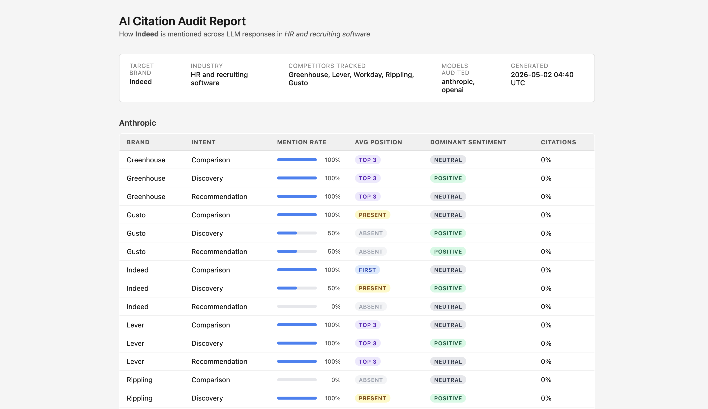

# AI Citation Audit Tool

A Python CLI that audits how a target brand is mentioned across multiple LLM APIs
(OpenAI, Anthropic, Perplexity). It fires a structured prompt battery at each model,
parses responses for brand and competitor mentions, scores citation quality, and
outputs a structured audit report.

**Sample analysis:** [AI Visibility Audit — HR & Recruiting Software (2025)](ANALYSIS.md)  
A full two-run audit of Indeed vs. Greenhouse, Lever, Workday, Rippling, and Gusto across OpenAI and Anthropic.

---

## Requirements

- Python 3.11+
- API keys for the models you want to query (OpenAI, Anthropic, Perplexity)

---

## Setup

**1. Clone and enter the project**

```bash
git clone <repo-url>
cd ai-citation-audit
```

**2. Create a virtual environment and install dependencies**

```bash
python -m venv .venv
source .venv/bin/activate       # Windows: .venv\Scripts\activate
pip install -e ".[dev]"
```

**3. Configure API keys**

```bash
cp .env.example .env
# Edit .env and fill in your API keys
```

---

## Usage

```bash
citation-audit \
  --brand "Salesforce" \
  --industry "CRM software" \
  --competitors "HubSpot,Zoho,Pipedrive" \
  --models openai,anthropic,perplexity \
  --output-dir ./reports
```

### All flags

| Flag | Required | Default | Description |
|---|---|---|---|
| `--brand` | yes | — | Target brand name |
| `--industry` | yes | — | Industry/category context |
| `--competitors` | no | — | Comma-separated competitor names |
| `--models` | no | all | `openai`, `anthropic`, `perplexity` (comma-separated) |
| `--output-dir` | no | `./reports` | Directory to write output files |
| `--use-case` | no | `--industry` | Specific use-case for prompt interpolation |

### Single-model run

```bash
citation-audit --brand "Notion" --industry "productivity software" --models anthropic
```

### Re-running without re-querying

Raw API responses are cached to `<output-dir>/raw/`. Delete that directory (or
specific files) to force a fresh query. Subsequent runs with the same flags will
parse and re-score from cache instantly.

---

## Output files

All files are written to `--output-dir` (default: `./reports`).

| File | Description |
|---|---|
| `citation_report.json` | Full raw data: prompt, model, response text, parsed mentions |
| `citation_summary.csv` | One row per brand × model × intent: rates, position, sentiment |
| `report.html` | Standalone HTML client deliverable — open in any browser |

### Sample output



*Screenshot placeholder — run the tool and open `reports/report.html` to see the live output.*

---

## Running tests

```bash
pytest
```

Expected output:

```
========================= test session starts =========================
collected 25 items

tests/test_parser.py .............                             [ 52%]
tests/test_scorer.py ............                              [100%]

========================= 25 passed in 0.45s =========================
```

---

## Architecture

```
src/citation_audit/
├── cli.py          # Typer entry point; orchestrates the full audit pipeline
├── prompts.py      # Prompt battery generator (6 prompts × 3 intents)
├── llm_clients.py  # Abstract LLMClient + OpenAI / Anthropic / Perplexity impls
├── parser.py       # Fuzzy mention detection, position ranking, sentiment heuristics
├── scorer.py       # Aggregates parsed results into per-(brand × model × intent) scores
├── reporter.py     # Writes JSON, CSV, and HTML reports
└── templates/
    └── report.html.j2  # Jinja2 HTML report template
```

### Adding a new LLM provider

1. Subclass `LLMClient` in `llm_clients.py`
2. Set `name = "your-provider"`
3. Implement `async def _complete(self, prompt_text: str) -> str`
4. Add it to `_CLIENT_MAP`

---

## Scoring reference

| Position label | Meaning |
|---|---|
| `FIRST` | Brand's first mention precedes all other tracked brands |
| `TOP_3` | Brand is within the first 3 brands mentioned |
| `PRESENT` | Brand is mentioned but outside the top 3 |
| `ABSENT` | Brand not detected in the response |

`avg_position_score` is the numeric mean across prompts (1=FIRST, 2=TOP\_3, 3=PRESENT, 4=ABSENT). Lower is better.
